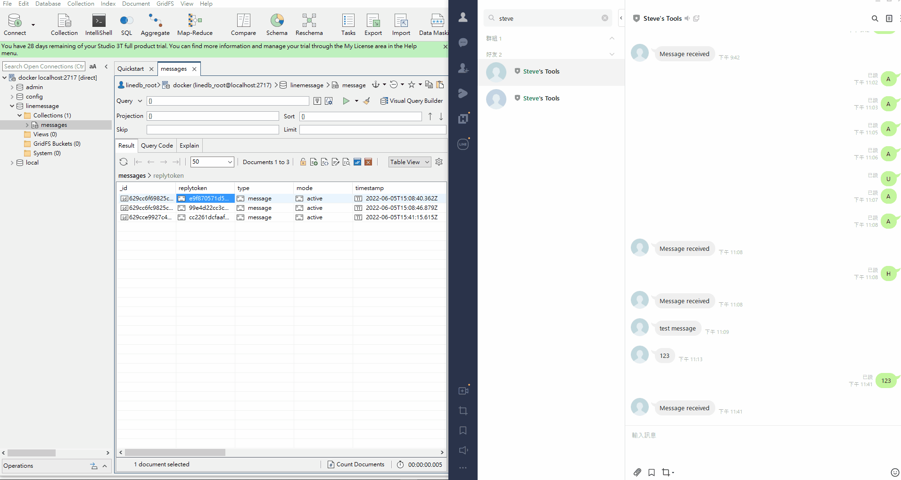

# cinnox-homework

## 簡介

此專案用 <b>Go</b> 練習連接 <b>Line Official Account</b> 並且利用 <b>API</b> 來讀取客戶傳來之訊息與推送訊息給客戶。
<br>
<br>

## 開發環境與套件
- 
- 
- 
- 
-  
-  
-  
-  

## 安裝方法
1. 下載 [mogodb](https://hub.docker.com/_/mongo?tab=tags)

2. 建立config/config.json
    ```
    {
        "lineChannelSecret": "你的Line Channel Secret",
        "lineChannelAccessToken": "你的Line Channel Access Token",
        "mongodbUser": "linedb_root",
        "mongodbPwd": "linedb_pwd",
        "databaseName": "linemessage",
        "collectionName": "messages"
    }
    ```
3. 進入專案資料夾並執行
   ```
   make linecommand_init
   ```
4. 完成後執行下列命令便會建立docker container 並開啟伺服器
   ```
   linebot init [專案絕對路徑]
   ```
   
5. 若要重新啟動請執行下列便可重新開啟伺服器。
    ```
   linebot start [專案絕對路徑]
    ```
   __*請確保 mongodb comtainer 沒有被刪除，若以刪除請使用上一步開啟伺服器*__

__*備註：Makefile中有開啟ngrok命令可供使用，若你想在本地端測試此專案可以安裝ngrok*__


## API介紹

### API-1 接收用戶訊息並存入資料庫(供 Line webhook 使用)
-----
`POST /callback`

#### Line Messaging API Webhook 設定

  
#### Demo

[圖片放大](https://github.com/stevetsaoch/cinnox-homework/blob/main/readme_gifs/API-1.gif)

### API-2 推播訊息給用戶(回傳所有接收訊息的用戶ID)
-----
#### Request
- 可用 Postman 或是 Command line 來執行


1. Postman

`POST /push`

```
http://localhost:8000/push
```
  - Request Body (JSON):
    ```
    {
        "message": "訊息"
    }
    ```

2. Command line 
```
linebot pushmessgae [message]
```

#### Response
回傳所有接收訊息的用戶ID
- Response Header:
```
POST /push HTTP/1.1
Content-Type: application/json
Host: localhost:8000
HTTP/1.1 200 OK
Content-Type: application/json; charset=utf-8
Date: Sun, 05 Jun 2022 12:43:31 GMT
```

- Response Body (JSON, Array of string):
```
["Ufe2722eb0bd0e2faf2aa5d380f14bcf3"]
```

#### Demo Command line

[圖片放大](https://github.com/stevetsaoch/cinnox-homework/blob/main/readme_gifs/post2_request.gif)

#### Demo Postman

[圖片放大](https://github.com/stevetsaoch/cinnox-homework/blob/main/readme_gifs/post1_request.gif)

### API-3 獲取所有收到訊息與其他相關資訊
-----
#### Request
`GET /all`

- Postman
```
http://localhost:8000/all
```

#### Response
回傳所有接收到的訊息
- Response Header:
```
GET /all HTTP/1.1
Content-Type: application/json
Host: localhost:8000
HTTP/1.1 200 OK
Content-Type: application/json; charset=utf-8
Date: Sun, 05 Jun 2022 12:45:26 GMT
```
- Response Body (JSON):
```
[
    {
        "id": "629c152b8b61740ceb21aa78",
        "replytoken": "4fdbd5b464494746987445c76746066e",
        "type": "message",
        "mode": "active",
        "timestamp": "2022-06-05T02:30:04.97Z",
        "source": {
            "type": "user",
            "userid": "Ufe2722eb0bd0e2faf2aa5d380f14bcf3",
            "groupid": "",
            "roomid": ""
        },
        "message": {
            "id": "16207443487929",
            "text": "Q",
            "emojis": null,
            "metion": ""
        },
        "joined": "",
        "left": "",
        "accountlink": "",
        "things": "",
        "members": "",
        "unsend": "",
        "vedioplaycomplete": ""
    }
]
```

#### Demo

[圖片放大](https://github.com/stevetsaoch/cinnox-homework/blob/main/readme_gifs/get_request.gif)
